# 📘 Модуль 1 — Пояснения к настройке сети 

1. [Произведите базовую настройку устройств](#1-произведите-базовую-настройку-устройств)
2. [Настройка IP-адресов](#2-настройка-ip-адресов)
3. [Настройте коммутацию в сегменте HQ следующим образом](#3-настройте-коммутацию-в-сегменте-hq-следующим-образом)
4. [Настройте часовой пояс на всех устройствах](#4-настройте-часовой-пояс-на-всех-устройствах)
5. [Настройте доступ к сети Интернет, на маршрутизаторе ISP](#5-настройте-доступ-к-сети-интернет-на-маршрутизаторе-isp)
6. [Создайте локальные учетные записи на серверах HQ-SRV и BR-SRV](#6-cоздайте-локальные-учетные-записи-на-серверах-hq-srv)

## 1. Произведите базовую настройку устройств

### 🍃 Маршрутизаторы (HQ-RTR, BR-RTR)

Основные режимы конфигурирования EcoRouter:

1. ecorouter> - пользовательский режим. Режим по умолчанию при подключении. Доступны базовые команды просмотра состояния (например, show)

2. ecorouter#, команда enable - привилегированный режим. Позволяет просматривать детальную конфигурацию и выполнять диагностику.

3. ecorouter(config)#, команда configure terminal - глобальная конфигурация. Используется для изменения глобальных настроек

Сохранение конфигурации маршрутизатора - write memory (иначе после перезагрузки всё пропадёт)

```
ecorouter>en
ecorouter#conf t
ecorouter(config)#hostname hq-rtr.au-team.irpo
hq-rtr.au-team.irpo(config)#ip domain-name au-team.irpo
hq-rtr.au-team.irpo(config)#exit
hq-rtr.au-team.irpo#write memory
```

```
ecorouter>en
ecorouter#conf t
ecorouter(config)#hostname br-rtr.au-team.irpo
br-rtr.au-team.irpo(config)#ip domain-name au-team.irpo
br-rtr.au-team.irpo(config)#exit
br-rtr.au-team.irpo#write memory
```

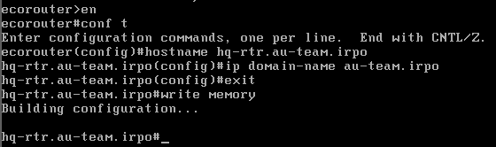

> [!NOTE]
> Имя устройства нужно для удобной идентификации и корректной работы DNS.
> Доменное имя устройства используется для генерации FQDN (полного имени) и работы DNS и SSH

### 🐧 ALT Linux (HQ-SRV, BR-SRV, HQ-CLI, ISP)

Устанавливаем hostname в системе Linux

```
hostnamectl set-hostname hq-srv.au-team.irpo;exec bash
hostnamectl set-hostname br-srv.au-team.irpo;exec bash
hostnamectl set-hostname hq-cli.au-team.irpo;exec bash
hostnamectl set-hostname ISP;exec bash
```

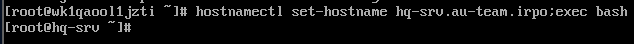

## 2. Настройка IP-адресов

(Согласно таблице ниже)

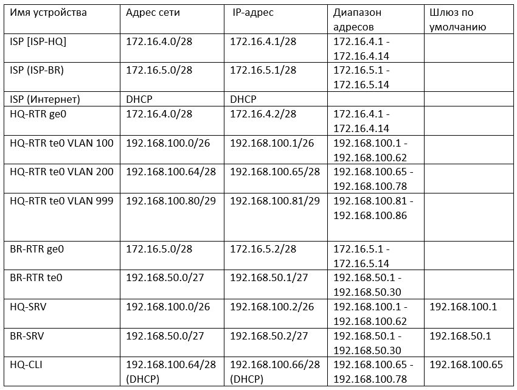

> [!NOTE]
> Не забываем сопоставить MAC-адрес интерфейса в системе с MAC-адресом соответствующего адаптера ВМ в среде виртуализации
> 
> Краткая шпаргалка по текстовому редактору VIM:
> 
> Нажать I на клавиатуре - режим редактирования текста
> 
> Нажать ESC на клавиатуре - выйти из текущего режима в командный
> 
> :wq - Записать изменения и выйти
> 
> :qa! - Выйти без применения изменений

### 🐧 ISP

```
echo HTTP_PROXY=http://10.0.21.52:3128 >> /etc/sysconfig/network
# Добавляет прокси (для выхода в интернет через прокси-сервер). Необходимо в условиях колледжской сети
# Для каждого региона используется свой прокси-сервер. У себя я его прописывать не буду.
ip a
# Показывает все сетевые интерфейсы и IP
ls /etc/net/ifaces
# Список сетевых интерфейсов (ALT Linux использует эту директорию)
mkdir /etc/net/ifaces/ens33
mkdir /etc/net/ifaces/ens34
# Создаёт папки для интерфейсов ens33 и ens34. Либо - mkdir /etc/net/ifaces/ens3{3,4}
vim /etc/net/ifaces/ens33/options
# Создание и открытие файла options через тексторый редактор vim
BOOTPROTO=dhcp
TYPE=eth
DISABLED=no
CONFIG_IPV4=yes
# Содержание файла options. Последние 2 строки необязательны во всех случаях
vim /etc/net/ifaces/ens33/options
BOOTPROTO=static
TYPE=eth
DISABLED=no
CONFIG_IPV4=yes
echo 172.16.4.1/28 > /etc/net/ifaces/ens33/ipv4address 
# Назначает статический IP
vim /etc/net/ifaces/ens34/options
BOOTPROTO=static
TYPE=eth
DISABLED=no
CONFIG_IPV4=yes
echo 172.16.5.1/28 > /etc/net/ifaces/ens34/ipv4address
systemctl restart network
# Перезагружаем службу для обновления настроек сети
```

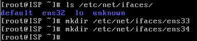

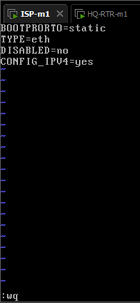

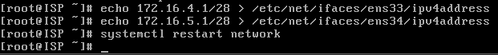

### 🐧 HQ-SRV

```
vim /etc/net/ifaces/ens19/options
# options уже корректно настроен. Перепроверить не помешает. Если что-то не так - изменяем.
echo 192.168.100.2/26 > /etc/net/ifaces/ens19/ipv4address
echo default via 192.168.100.1 > /etc/net/ifaces/ens19/ipv4route
systemctl restart network
```

> [!NOTE]
> На этом моменте идёт особенность конфигурирования в VMware Workstation. В Proxmox показано выше (нумерация интерфейсов там другая, посмотрите самостоятельно)
> 
> Различие в интерфейсах HQ-SRV и HQ-CLI, поскольку в VMware Workstation нет VSwitch (как в ESXI)
>
> и нет присвоения VLAN-тэга из под инструментария (как в Proxmox), с помощью которых добавится VLAN тег.
> 
> Поэтому VLAN приходится делать внутри Linux (ens32.X). Ниже показаны команды.
> 
> Выставляется MTU на значение 1400 (Влановые интерфейсы чувствительны к этому параметру, обеспечивает ping и открытие веб-приложения в дальнейшем на HQ-CLI)

```
vim /etc/net/ifaces/ens32/options
TYPE=eth
BOOTPROTO=static
ONBOOT=yes
# Изменяем содержание к этому ввиду
mkdir /etc/net/ifaces/ens32.100
# VLAN 100, поэтому интерфейс ens32.100
vim /etc/net/ifaces/ens32.100/options
TYPE=vlan
HOST=ens32
VID=100
BOOTPROTO=static
ONBOOT=yes
echo 192.168.100.2/26 > /etc/net/ifaces/ens32.100/ipv4address
echo default via 192.168.100.1 > /etc/net/ifaces/ens32.100/ipv4route
echo mtu 1400 > /etc/net/ifaces/ens32.100/iplink
# Такая директория на alt linux для выставления нового значения MTU
# (файл применяет параметры в формате команды ip link)
systemctl restart network
```

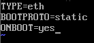

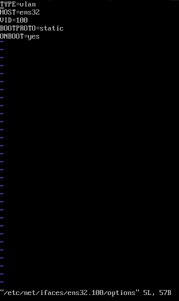

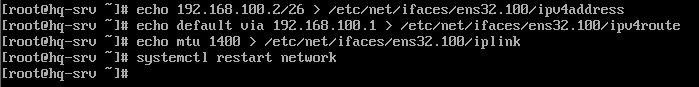

### 🐧 HQ-CLI

Для Proxmox

```
vim /etc/net/ifaces/ens32/options
# Изменяем следующие строчки
NM_CONTROLLED=no
DISABLED=no
BOOTPROTO=dhcp
echo default via 192.168.100.65 > /etc/net/ifaces/ens32/ipv4route
systemctl restart network
```

Для VMware Workstation

```
vim /etc/net/ifaces/ens32/options
TYPE=eth
BOOTPROTO=static
ONBOOT=yes
# Изменяем содержание к этому ввиду
mkdir /etc/net/ifaces/ens32.200
# VLAN 200, поэтому интерфейс ens32.200
vim /etc/net/ifaces/ens32.200/options
TYPE=vlan
HOST=ens32
VID=200
BOOTPROTO=dhcp
ONBOOT=yes
echo default via 192.168.100.65 > /etc/net/ifaces/ens32.200/ipv4route
echo mtu 1400 > /etc/net/ifaces/ens32.200/iplink
systemctl restart network
```

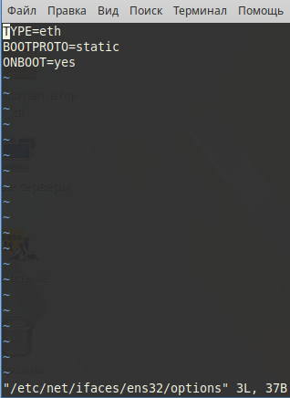

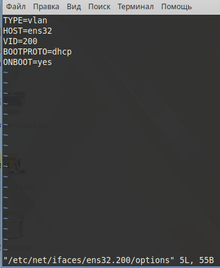

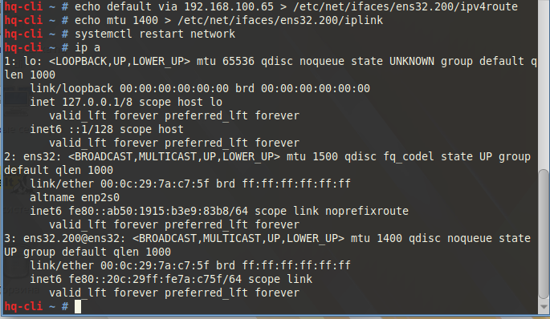

### 🐧 BR-SRV

```
# options уже корректно настроен. Перепроверьте на всякий - не помешает.
echo 192.168.50.2/27 > /etc/net/ifaces/ens32/ipv4address
echo default via 192.168.50.1 > /etc/net/ifaces/ens32/ipv4route
systemctl restart network
```

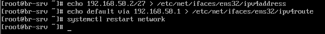

## 3. Настройте коммутацию в сегменте HQ следующим образом

### 🍃 HQ-RTR

VMware Workstation / Proxmox 

(В Proxmox интерфейсы te0 и te1 - поймёте где-будут отличия, no service-instance прописывать в proxmox не надо, там ненужной "сущности" по умолчанию нет)

```
#show run port
conf t
(config)#port ge0
no service-instance ge0
service-instance ge0/isp-hq
encapsulation untagged
exit
exit

(config)#port te0
service-instance te0/srv-net
encapsulation dot1q 100
rewrite pop 1
exit
service-instance te0/cli-net
encapsulation dot1q 200
rewrite pop 1
exit
service-instance te0/management
encapsulation dot1q 999
rewrite pop 1
exit
exit

(config)#interface eth1
ip address 172.16.4.2/28
connect port ge0 service-instance ge0/isp-hq
ip nat outside
exit

(config)#interface eth2
ip address 192.168.100.1/26
connect port te0 service-instance te0/srv-net
ip nat inside
exit

(config)#interface eth3
ip address 192.168.100.65/28
connect port te0 service-instance te0/cli-net
ip nat inside
exit

(config)#interface eth4
ip address 192.168.100.81/29
connect port te0 service-instance te0/management
ip nat inside
exit
exit

#write мемоry
```

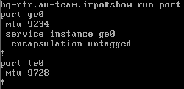

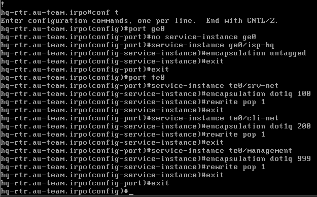

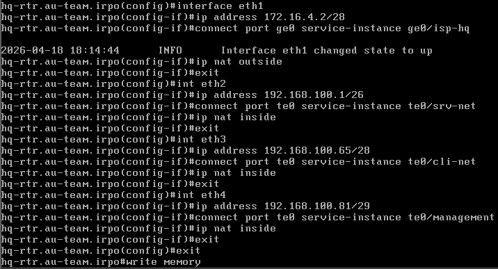

### 🍃 BR-RTR

```
(config)#port ge0
no service-instance ge0
service-instance ge0/isp-br
encapsulation untagged
exit
exit

(config)#port te0
service-instance te0/br-net
encapsulation-untagged
exit
exit

(config)#interface eth1
ip address 172.16.5.2/28
connect port ge0 service-instance ge0/isp-br
ip nat outside
exit

(config)#interface eth2
ip address 192.168.50.1/27
connect port te0 service-instance te0/br-net
ip nat inside
exit
exit

#write memory
```

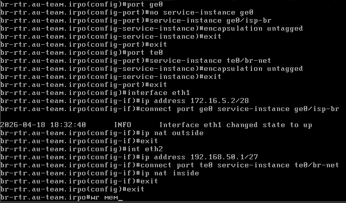

Можно проверить пинги на данном этапе - ISP↔HQ-RTR, ISP↔BR-RTR, HQ-RTR↔HQ-SRV, BR-RTR↔BR-SRV

> [!NOTE]
> Проверьте включён ли адаптер в сторону LAN у HQ-RTR и BR-RTR в WMware - галочка на "Connect at power on". Говорю, потому что у меня эта галочка не была проставлена после ping проверок. Поэтому часть пингов не проходила.

## 4. Настройте часовой пояс на всех устройствах

### 🐧 ALT Linux (HQ-SRV, BR-SRV, HQ-CLI)

```
timedatectl set-timezone Europe/Moscow
```

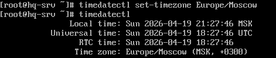

### 🐧 ISP

```
apt-get update
apt-get install tzdata -y
exec bash
timedatectl set-timezone Europe/Moscow
```

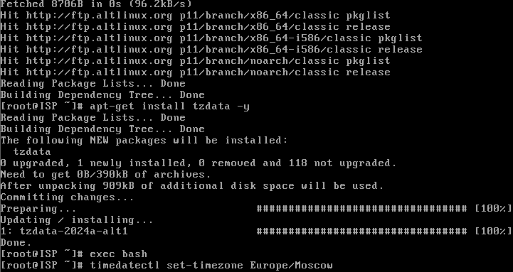

### 🍃 EcoRouters (HQ-RTR, BR-RTR)

```
(config)#ntp timezone utc+3
exit
write memory
```

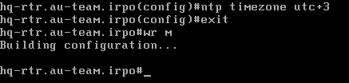

## 5. Настройте доступ к сети Интернет, на маршрутизаторе ISP

> [!NOTE]
> Настраиваем NAT с помощью nftables, обеспечивая подмену всех внутренних IP-адресов на IP-адрес внешнего интерфейса ISP для исходящего трафика. Используем конструкцию "cat <<'EOT' > " для передачи многострочного текста в команду. Команда cat в Linux может работать не только с файлами, но и с потоком ввода (stdin). Если ей не указывать файл, она начинает получать данные из терминала. EOT здесь выступает в роли маркера, который указывает на завершение ввода данных для команды cat.
>
> Соблюдаем отступы. Также можно просто vim'ом открыть файл и вписать содержимое. Но так круче)
>
> Включаем глобальную маршрутизацию в Linux. Лучше именно так, после перезагрузки значение на 0 сбрасываться не будет.

### 🐧 ISP

```
apt-get install nftables -y
cat <<'EOT' > /etc/nftables/nftables.nft
#!/usr/sbin/nft -f
flush ruleset
table ip nat {
 chain postrouting {
  type nat hook postrouting priority srcnat
  oifname "ens32" masquerade
 }
}
EOT
systemctl enable --now nftables

echo net.ipv4.ip_forward = 1 > /etc/sysctl.d/99-ipforward.conf
sysctl --system
cat /proc/sys/net/ipv4/ip_forward  # для проверки
```

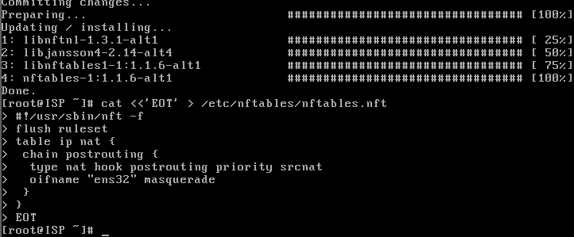

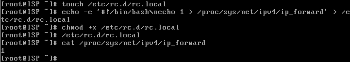

## 6. Создайте локальные учетные записи на серверах HQ-SRV и BR-SRV


