# 📘 Модуль 2 — Пояснения к сетевому администрированию

Покажу этот модуль на Proxmox, отличия с VMware Workstation будут только в интерфейсах (ens18/19, te0/1, ...)

Если вы не ознакомились с особенностью в 1-ом модуле - ознакомьтесь в пункте "2. Настройка IP-адресов"

1. [Установка Яндекс Браузера на HQ-CLI](#1-установка-яндекс-браузера-на-hq-cli)
2. [Настройка службы сетевого времени (chrony) на ISP](#2-настройка-службы-сетевого-времени-chrony-на-isp)
3. [Конфигурация файлового хранилища на HQ-SRV](#3-конфигурация-файлового-хранилища-на-hq-srv)
4. [Настройка NFS-сервера на HQ-SRV](#4-настройка-nfs-сервера-на-hq-srv)
7. [Развёртывание веб-приложения на HQ-SRV](#5-развёртывание-веб-приложения-на-hq-srv)
8. [Настройка Ansible на BR-SRV](#6-настройка-ansible-на-br-srv)
9. [Развёртывание веб-приложения в Docker на BR-SRV](#7-развёртывание-веб-приложения-в-docker-на-br-srv)
10. [Настройка статической трансляции портов на маршрутизаторах](#8-настройка-статической-трансляции-портов-на-маршрутизаторах)
11. [Настройка nginx как обратного прокси на ISP](#9-настройка-nginx-как-обратного-прокси-на-isp)
12. [Настройка web-based аутентификации на ISP](#10-настройка-web-based-аутентификации-на-isp)
13. [Настройка Samba DC на BR-SRV](#11-настройка-samba-dc-на-br-srv)

Ниже представлены IP'шники у ВМ'ок в Proxmox. Реальная нумерация интерфейсов в колледже - ens18, ens19, ens20. У меня такая - ens19, ens20, ens21. C первым модулем такая же история.

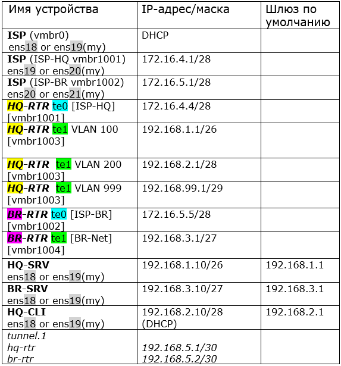

## 1. Установка Яндекс Браузера на HQ-CLI

> [!NOTE]
> Установим простым способом через официальные репозитории ALT

### 🐧 HQ-CLI

```
apt-get update
apt-get install yandex-browser-stable -y
yandex-browser-stable    #запускаем под обычным пользователем (не root)
```

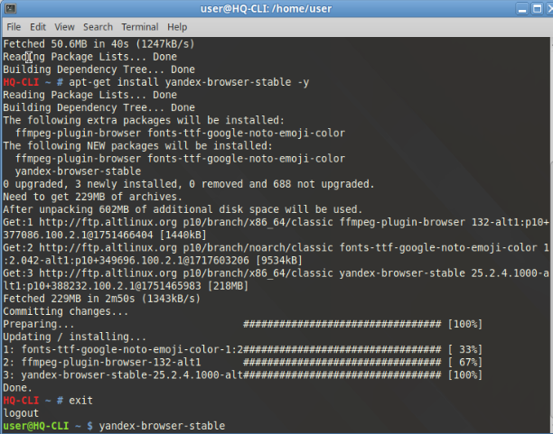

## 2. Настройка службы сетевого времени (chrony) на ISP

> [!NOTE]
> Установку chrony производим на ISP, HQ-SRV, HQ-CLI и BR-SRV.
> 
> pool pool.ntp.org iburst - это вышестоящий внешний сервер NTP по умолчанию, его и оставим
> 
> local stratum 5 - это позиция нашего ISP в иерархии NTP-серверов
>
> По правильному мы должны вписать 5 наших сетей, попадающих под использование NTP:
> 
> allow 172.16.4.0/28
>
> allow 172.16.5.0/28
>
> allow 192.168.1.0/26
>
> allow 192.168.2.0/28
>
> allow 192.168.50.0/27
>
> Покажу по простому варианту - указать все сети: allow 0.0.0.0/0
>
> chronyc tracking показывает у меня 3 из-за отсутствия ограничений выхода ко внешним NTP-серверам - это нормально. В сети колледжа выхода к ним не будет, stratum покажет 5. Также может наблюдаться расхождение во времени на колледжском стенде, ничего страшного - это не наша проблема
>
> Устанавливать chrony приходится только на HQ-SRV и BR-SRV. У ISP и HQ-CLI chrony предустановлен

### 🐧 ISP

```
# chrony уже предустановлен, проверить rpm -qa | grep chrony
vim /etc/chrony.conf
# под строчкой pool pool.ntp.org iburst пишем:
local stratum 5
allow 0.0.0.0/0

systemctl enable --now chronyd
systemctl restart chronyd

chronyc tracking  #проверка
```

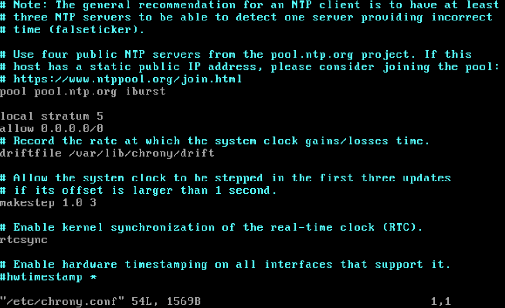

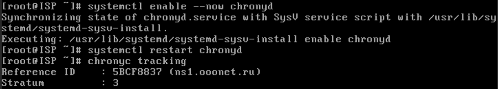

### 🐧 HQ-SRV, HQ-CLI

```
apt-get update
apt-get install chrony -y
vim /etc/chrony.conf
# закомментируем строчку:
pool pool.ntp.org iburst
# добавим:
server 172.16.4.1 iburst

systemctl restart chronyd
systemctl enable --now chronyd

# проверки:
chronyc sources
date
```

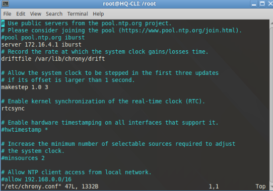

### 🐧 BR-SRV

```
apt-get update
apt-get install chrony -y
vim /etc/chrony.conf
# закомментируем строчку:
pool pool.ntp.org iburst
# добавим:
server 172.16.5.1 iburst

systemctl restart chronyd
systemctl enable --now chronyd

# проверки:
chronyc sources
date
```

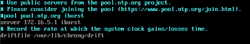

### 🍃 BR-RTR

```
(config)#ntp server 172.16.5.1
exit

#write memory

# проверки:
show ntp status
show ntp date
```

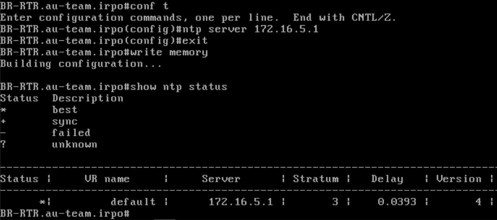

## 3. Конфигурация файлового хранилища на HQ-SRV

> [!NOTE]
> Создаём массив RAID 0 из двух дисков (они уже подключены к ВМ). Форматируем под файловую систему ext4. Автоматически монтируем массив в каталог /raid
>
> mdadm предустановлен на HQ-SRV. Проверить: rpm -qa | grep mdadm

### 🐧 HQ-SRV

```
mdadm --create /dev/md0 -l0 -n 2 /dev/sdb /dev/sdc
mkfs.ext4 /dev/md0

# добавляем информацию о RAID-массиве:
echo "DEVICE partitions" > /etc/mdadm.conf
mdadm --detail --scan >> /etc/mdadm.conf

mkdir /raid
vim /etc/fstab
# добавляем строчку (жмём tab после каждого параметра):
/dev/md0	/raid	ext4	defaults	0	0
mount -av

# проверки:
df -h
lsblk
```

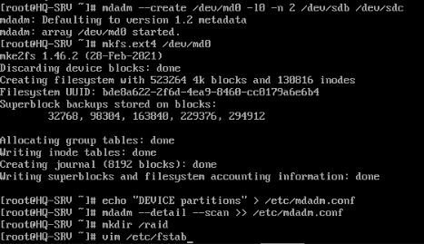

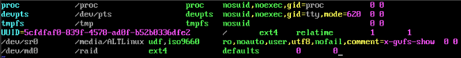

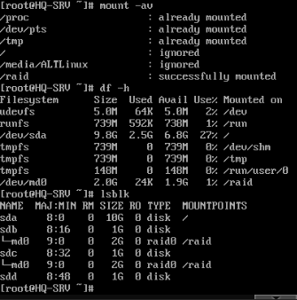

## 4. Настройка NFS-сервера на HQ-SRV

> [!NOTE]
> NFS (Network File System) — это протокол распределённой файловой системы, который позволяет компьютерам в сети обмениваться файлами так, будто они расположены локально, хотя физически находятся на сервере (физическом или виртуальном). С помощью NFS можно монтировать удалённую директорию на локальном компьютере, делая её доступной как локальные файлы.
>
> На HQ-SRV создаём каталог nfs на недавно созданном raid массиве. В /etc/export определяем директорию, которая будет доступна удалённым клиентам (всеи из сети HQ-CLI), и задаём параметры доступа.
>
> rw — разрешает клиенту чтение и запись в экспортируемую директорию
>
> sync — отвечать на следующие запросы только тогда, когда данные будут сохранены на диск
>
> no_subtree_check — отключить проверку обращения к экспортированной папке
>
> На клиенте монтируем сетевой каталог в локальную точку монтирования и обеспечиваем автомонтирование
>
> Конечная проверка. На HQ-CLI создать файл: touch /mnt/nfs/testfile
>
> На HQ-SRV проверить что каталог отобразился и тем самым понять, что NFS успешно настроен: ls /raid/nfs

### 🐧 HQ-SRV

```
apt-get install nfs-server -y
systemctl enable --now nfs-server

mkdir -p /raid/nfs
chmod 777 /raid/nfs

# добавляем строку в /etc/exports:
echo "/raid/nfs 192.168.2.0/28(rw,sync,no_subtree_check)" >> /etc/exports

# экспортируем каталоги:
exportfs -rav
```

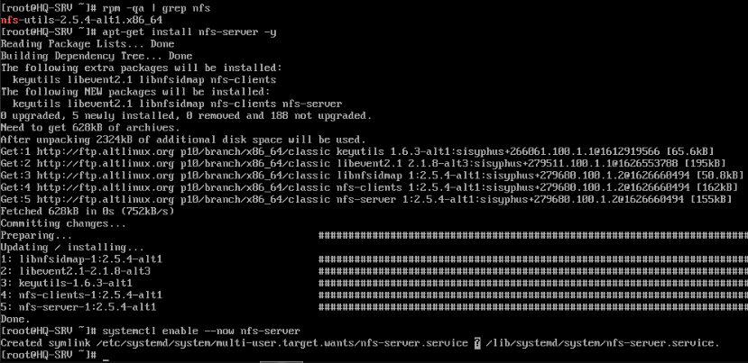

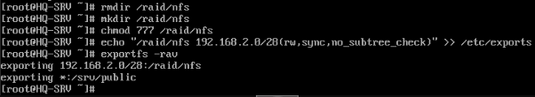

### 🐧 HQ-CLI

```
mkdir /mnt/nfs
mount 192.168.1.10:/raid/nfs /mnt/nfs

vim /etc/fstab
# добавляем строку (жмём tab после каждого параметра):
192.168.1.10:/raid/nfs  /mnt/nfs  nfs  defaults,_netdev  0  0
mount -av
```

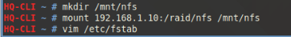

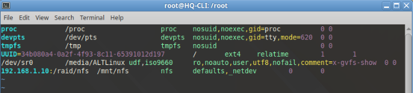

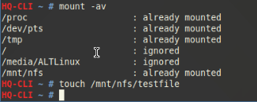

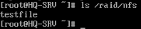

## 5. Развёртывание веб-приложения на HQ-SRV

> [!NOTE]
> Поднимаем простенькое веб-приложение с базой данных, с помощью apache HTTP Server и mariadb server.
>
> Используем подготовленные файлы из каталога "web" Additional.iso
>
> MariaDB — форк MySQL с открытым исходным кодом. 
>
> Apache — веб-сервер с открытым исходным кодом. Выступает посредником между файлами сайта, которые хранятся на файловой системе сервера, и пользователями, которые хотят на сайт зайти.
> 
> MariaDB в связке с Apache — это классическая конфигурация для создания веб-серверов, известная как LAMP-стек (Linux, Apache, MariaDB, PHP). Такая установка позволяет размещать динамические веб-сайты и приложения, где Apache обрабатывает HTTP-запросы, MariaDB хранит данные, а PHP выполняет обработку динамического контента.
> 
> Весь процесс можно разделить на 7 этапов:
>
> 1) Установка Apache
>
> 2) Установка MariaDB
>
> 3) Создание базы данных
>
> 4) Импорт базы данных
>
> 5) Копирование файлов сайта
>
> 6) Настройка подключения к БД
>
> 7) Открытие веб-приложения с клиента

Подключаем Additional.iso к HQ-SRV и BR-SRV (для дальнейшего задания - развёртывание веб-приложения в Docker). Перед подключением выключаем виртуалки.

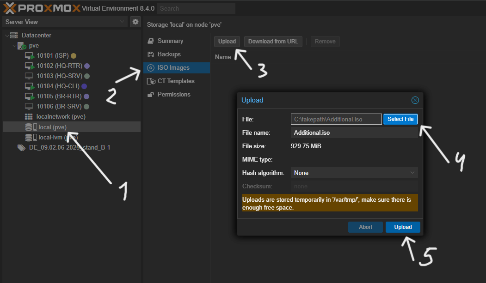

После upload'а на хранилище, добавляем CD/DVD устройство и подключаем к нему Additional.iso

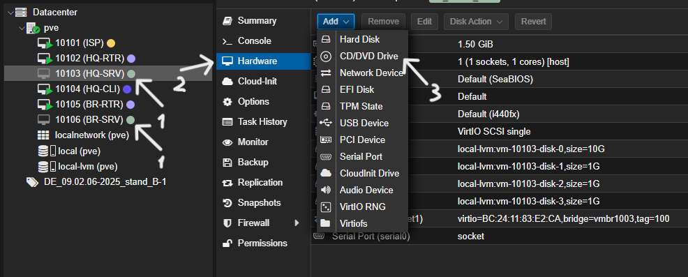

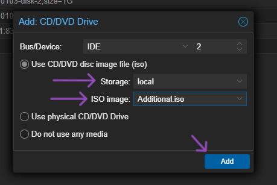

Запускаем обратно виртуалки и готово. Проверить - lsblk

```
apt-get install httpd2 apache2-mod_php8.1 php8.1 php8.1-mysqlnd php8.1-mysqli -y
systemctl enable --now httpd2

apt-get install mariadb-server -y
systemctl enable --now mariadb

mysql -u root
CREATE DATABASE webdb;
CREATE USER 'web'@'localhost' IDENTIFIED BY 'P@ssw0rd';
GRANT ALL PRIVILEGES ON webdb.* TO 'web'@'localhost';
FLUSH PRIVILEGES;


```


## 6. Настройка Ansible на BR-SRV


## 7. Развёртывание веб-приложения в Docker на BR-SRV


## 8. Настройка статической трансляции портов на маршрутизаторах


## 9. Настройка nginx как обратного прокси на ISP


## 10. Настройка web-based аутентификации на ISP


## 11. Настройка Samba DC на BR-SRV


