# Развёртывание стенда (реализация)

## Введение

Для начала определимся с текущей задачей.

Нам нужно создать 6 виртуальных машин:

* ISP
* HQ-RTR
* BR-RTR
* HQ-SRV
* HQ-CLI
* BR-SRV

И настроить корректную логику сетевых адаптеров, чтобы между ними была нормальная взаимосвязь.

---

## Способы реализации

Для домашней реализации есть 3 варианта виртуализации:

### 1. Виртуальные машины (VirtualBox / VMware Workstation)

Самый простой способ. Подходит для старта, не требует сложной настройки.

---

### 2. Proxmox VE в виде виртуальной машины

Proxmox устанавливается как виртуальная машина (например, через VirtualBox или VMware).

Принцип работы в целом похож на вариант с установкой на железо.

Плюсы:

* всё находится на одном компьютере
* ближе к реальному экзамену

Минусы:

* сложнее в реализации
* требует больше ресурсов

Насчёт этого варианта — попробовал. Но к сожалению, у меня EcoRouter'ы полностью не стартуют, а  с остальными ВМ'ками проблем нет. Зависают, на строчке "Starting new kernel" потребляя только 400 МБ из 4 ГБ выделенных.

Не знаю в чём проблема, у одногруппника они запускаются.

Пробовал ставить Proxmox VE в VMware Workstation и VirtualBox. Результат одинаковый (на VBox плюсом ещё интернет ISP не получает, нужно дополнительно исправить)

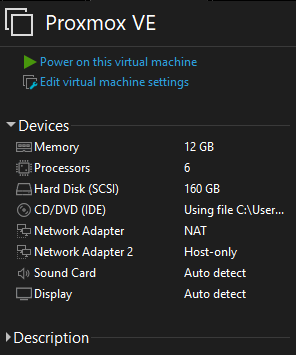

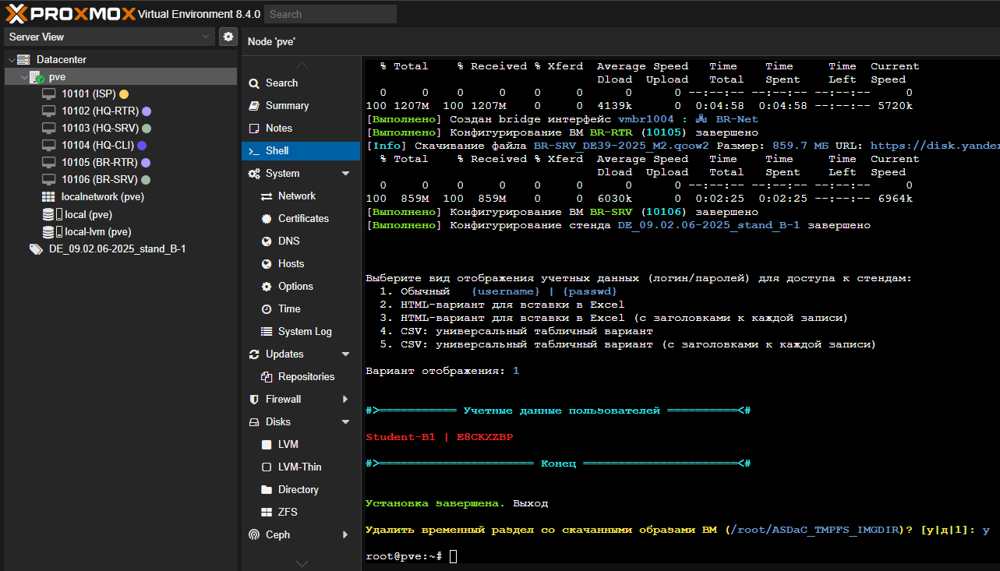

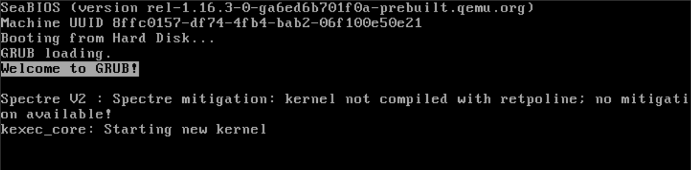

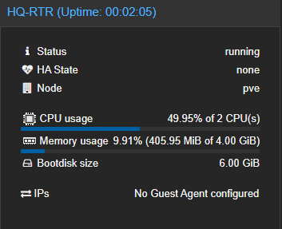

# Вот какие выводы сделал Chat GPT. Имейте это ввиду, если проворачиваете на ноутбуке

# 🧾 Заключение по проблеме запуска EcoRouter

## 📌 Исходные условия

* Гипервизор: VMware Workstation Pro
* Внутри: Proxmox VE (nested virtualization)
* Проблемная ВМ: EcoRouter
* CPU: Intel Core i5-11400H

---

## ⚠️ Симптом

* EcoRouter зависает на этапе:

kexec_core: Starting new kernel
* Дальнейшая загрузка отсутствует

---

## 🔍 Проведённая диагностика

Проверено и исключено:

* ✔️ Nested virtualization включён и работает
* ✔️ CPU type: host
* ✔️ Hyper-V отключён
* ✔️ Конфигурации ВМ идентичны рабочим стендам
* ✔️ Проверены CPU flags (включение/исключение)
* ✔️ Использованы hidden=1, q35
* ✔️ Исключён invtsc
* ✔️ Проверены args и чистый конфиг

Дополнительно:

* На других CPU (Intel Core i5-12400F, AMD Ryzen 3 3200G) стенд работает
* В том же VMware Workstation Pro без Proxmox — EcoRouter запускается

---

## 🧠 Причина

👉 Ограничение вложенной виртуализации:

VMware Workstation Pro → Proxmox VE → EcoRouter

В данной конфигурации:

* VMware не пробрасывает необходимые MSR/VMX-функции CPU
* EcoRouter использует kexec (перезапуск ядра)
* второе ядро не может корректно инициализировать CPU

👉 В результате возникает зависание на этапе kexec

---

## ❗️ Важное уточнение

Проблема:

* ❌ не связана с конфигурацией ВМ
* ❌ не связана с Proxmox
* ❌ не связана с самим EcoRouter

👉 Это ограничение конкретной связки:

* nested virtualization
* мобильный CPU Intel Core i5-11400H
* реализация виртуализации в VMware

---

## ✅ Вывод

👉 Запуск EcoRouter в данной архитектуре невозможен (или крайне нестабилен)

---

### 3. Proxmox VE на реальном железе

Установка на отдельный компьютер.

Схема работы:

* один компьютер — сервер с Proxmox и виртуальными машинами
* второй компьютер — для подключения и настройки через веб-интерфейс

Это максимально приближено к реальному демоэкзамену.

---

### Важные моменты по Proxmox

Для установки потребуется отдельный диск.

Если у вас на компьютере уже стоит Windows и вы не хотите её сносить, то:

* Windows не видит файловую систему Linux (ext4)
* Linux не работает с NTFS как с основной системой

В итоге:

* диск полностью форматируется под ext4
* получается dual boot

Поэтому для меня этот 3 вариант не подходит и использовать его я точно не буду.

---

Также:
для нормальной работы Proxmox желательно проводное подключение.

По информации из сети, через Wi-Fi возможны проблемы с виртуальными коммутаторами и стабильностью стенда.

---

## Автоматизация

Для Proxmox есть готовый скрипт, который позволяет развернуть стенд автоматически.

https://github.com/PavelAF/PVE-ASDaC-BASH

Я не являюсь автором и это не реклама, просто делюсь ресурсом из открытого доступа.

В этом репозитории есть:

* скрипт для модуля 1
* скрипт для модуля 2

Причём модуль 2 — это уже стенд с выполненным модулем 1.

---

В целом, при использовании Proxmox:

основная сложность — установка и начальная настройка системы
само развёртывание стенда делает скрипт

Это удобно и экономит время.

---

## Мой подход

Поскольку на экзамене времени даётся немного, я хочу:

* набить руку в быстром конфигурировании
* делать всё по памяти
* параллельно заполнять отчёт

Поэтому я и делаю этот репозиторий:

* как удобную шпаргалку для себя
* и как помощь для других

Потому что хранить всё в txt-файлах на флешке неудобно:

* плохое форматирование
* сложно читать
* сложно структурировать

Поскольку реальный экзамен проходит в среде Proxmox, работа с ним выглядит следующим образом:

мы просто открываем браузер, вводим
[http://ip-сервера:порт]
и выполняем все задания через веб-интерфейс.

Соответственно, 2 и 3 способы (использование Proxmox) являются наиболее приближенными к реальным условиям экзамена.

С веб-интерфейсом Proxmox я уже знаком и работал с ним во время учебной практики в колледже, где мы также решали демоэкзамен.

---

В моём варианте реализации:

* либо я просто продолжаю выполнение модуля 1
* либо создаю отдельные виртуальные машины, где модуль 1 уже настроен, и использую их как базу для модуля 2

---

При повторении конфигурирования это удобно:

* можно делать снимки (snapshots) виртуальных машин
* можно выгружать ВМ вместе с конфигурацией в отдельный каталог
* затем загружать их обратно в нужный момент

Таким образом:
не нужно каждый раз поднимать всё с нуля, можно быстро вернуться к нужному этапу и продолжить выполнение.


---

## Выбранный способ

Я буду показывать реализацию через виртуальные машины в VMware Workstation.

Это:

* быстрее для старта
* проще
* знакомо лично мне
* требует меньше ресурсов

Да, есть лишние действия (например, настройка сетей вручную), которых нет в Proxmox, но это не критично.

Главное — понимание конфигурации.

---

## Почему VMware, а не VirtualBox

1. По моим наблюдениям, виртуальные машины работают быстрее
2. С 11 ноября 2024 года VMware Workstation стал бесплатным
3. У меня есть образ EcoRouterOS в формате VMDK

VirtualBox такой формат напрямую не использует, поэтому выбор очевиден.

---

## Важно про маршрутизаторы

На демоэкзамене могут использоваться:

* EcoRouterOS
* ALT JeOS

В моём случае:
я буду использовать **EcoRouterOS** для маршрутизаторов HQ-RTR и BR-RTR.

---

## Ограничения

Реализовать вариант с установкой Proxmox на отдельное железо у меня нет возможности.

---

## Моя конфигурация хост-системы

Ноутбук:

* CPU: 6 ядер / 12 потоков
* RAM: 16 GB
* Диск: более 400 GB под виртуальные машины

Этого достаточно для работы стенда.

Видеокарта роли почти не играет, особенно для серверных ВМ без графической оболочки.

---

## Характеристики виртуальных машин

### ISP (ALT JeOS systemd)

* CPU: 1 ядро
* RAM: 1 GB
* Диск: 30 GB
* Сетевые адаптеры:

  * выход в интернет
  * подключение к HQ-RTR
  * подключение к BR-RTR

---

### HQ-RTR (EcoRouterOS)

* CPU: минимум 2 ядра (лучше 4)
* RAM: от 4 GB
* Диск: используется готовый образ (VMDK)
* Сетевые адаптеры:

  * к ISP
  * в HQ-сеть

---

### BR-RTR (EcoRouterOS)

* CPU: минимум 2 ядра (лучше 4)
* RAM: от 4 GB
* Диск: используется готовый образ
* Сетевые адаптеры:

  * к ISP
  * в BR-сеть

---

### HQ-SRV (ALT Server 10.1)

* CPU: 1 ядро
* RAM: 1–2 GB
* Диск: 30-40 GB
* Сеть: 1 адаптер

---

### HQ-CLI (ALT Workstation 10.1)

* CPU: 2 ядра
* RAM: 2 GB
* Диск: 30-40 GB
* Сеть: 1 адаптер

---

### BR-SRV (ALT Server 10.1)

* CPU: 1 ядро
* RAM: 1–2 GB
* Диск: 30-40 GB
* Сеть: 1 адаптер

---

## Скриншоты

Скриншоты процесса развёртывания будут находиться в папке:

pictures-r

---

## Начало развёртывания

### Шаг 1

Установите VMware Workstation
(отдельной инструкции не будет)

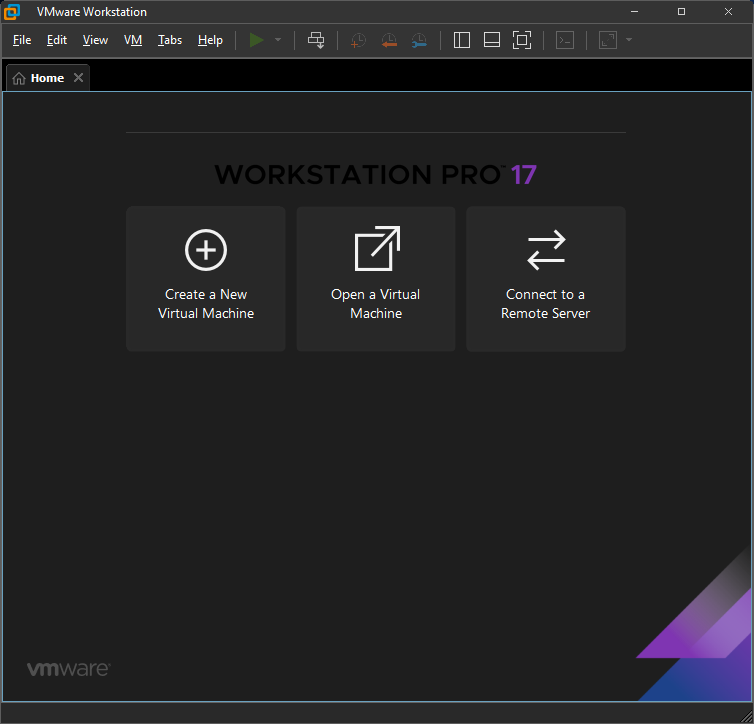

Моя версия:
VMware Workstation 17 Pro
Version: 17.6.4 build-24832109

---

## Шаг 2 — создание виртуальной машины ISP

Создаём новую виртуальную машину ISP:

Выбираем "Create a New Virtual Machine" → тип конфигурации "Custom", затем просто далее.

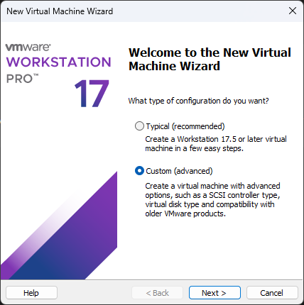

---

### Шаг 3

Пока что выбираем:

"I will install the operating system later"

Позже подключим ISO.

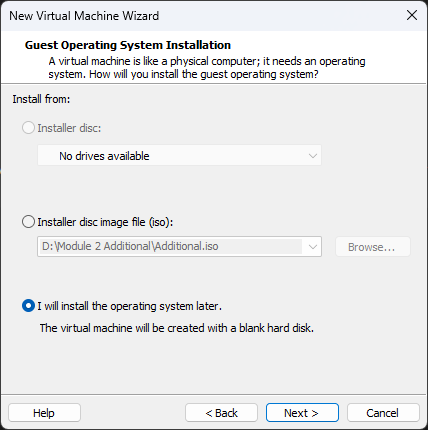

---

### Шаг 4

Выберем тип гостевой ОС:
Other 64-bit

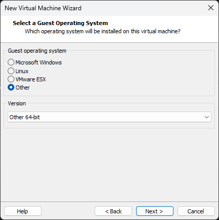

---

### Шаг 5

Имя ВМ — любое, например:
ISP-m1

Location — укажите каталог, где хотите сохранять файлы ВМ.

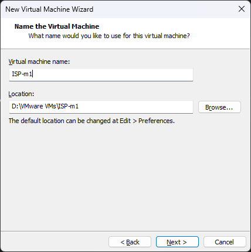

---

### Шаг 6

Выбираем:

* 1 процессор
* 1 ядро на процессор

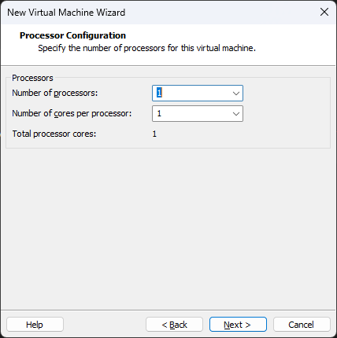

---

### Шаг 7

Указываем объём ОЗУ:
1024 MB

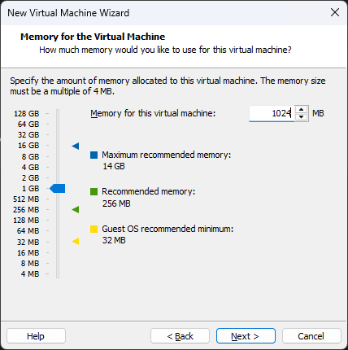

---

### Шаг 8

Выбираем:

"Do not use a network connection"

Позже добавим сетевые адаптеры.

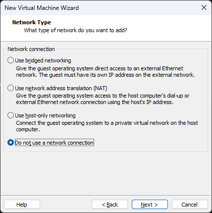

---

### Шаг 9

I/O controller types.

Можно выбрать любой, я выберу:

"Paravirtualized SCSI"

Он оптимизирован для виртуальных сред.

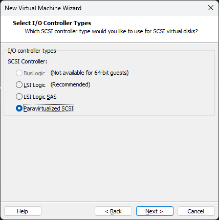

---

### Шаг 10

Virtual disk type.

Я выберу:
"SCSI"

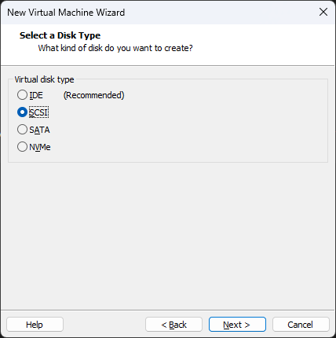

---

### Шаг 11

Выбираем:

"Create a new virtual disk"

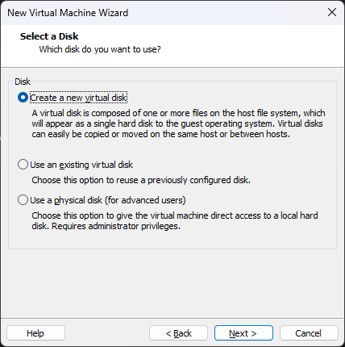

Максимальный размер:
30 GB

Выбираем:
"Store virtual disk as a single file"

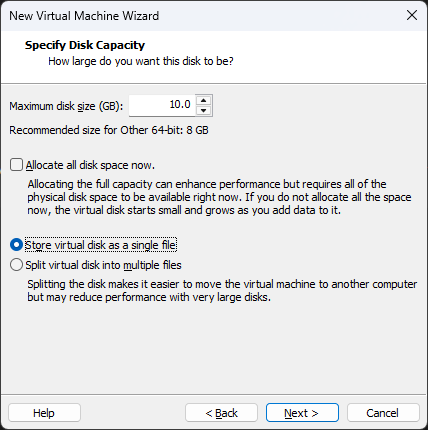

Затем просто далее и Finish.

---

ВМ создана, но нужно:

* подключить ISO образ
* создать сетевые адаптеры

---

### Шаг 12

Жмём:

"Edit virtual machine settings"

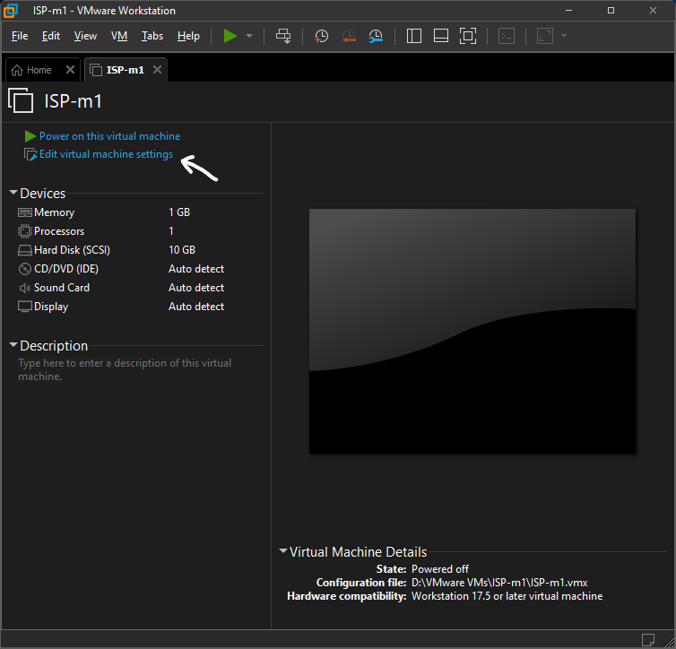

На вкладке CD/DVD:

* выбираем "Use ISO image file:"
* жмём "Browse"

Выбираем подготовленный образ Alt JeOS на базе systemd.

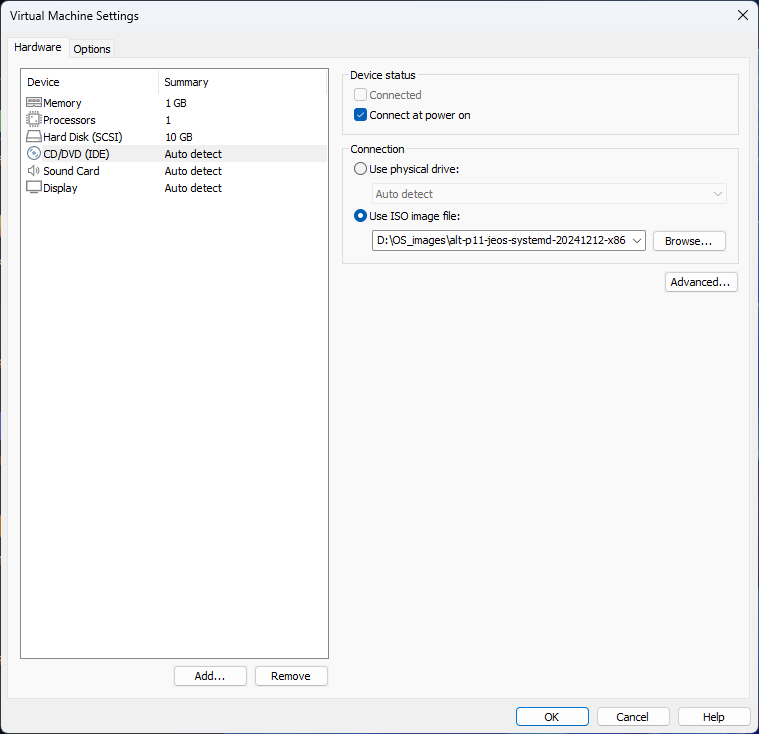

---

Справка:

Systemd — это подсистема инициализации и управления службами.
Выполняется как процесс с PID = 1 и запускает остальную часть системы.
Отвечает за инициализацию пользовательского пространства и управление службами во время загрузки.

---

### Шаг 13

Нажимаем:

"Add" → "Network Adapter"

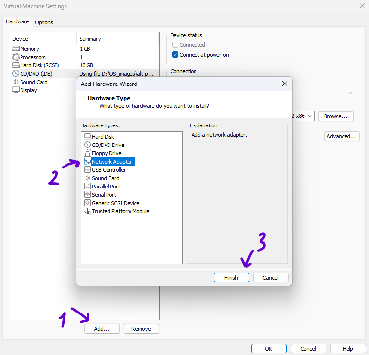

И так 2 раза.

---

1️⃣ Первый адаптер

* Network connection: Custom
* VMnet8 (NAT). Этот адаптер будет использоваться для выхода наружу.

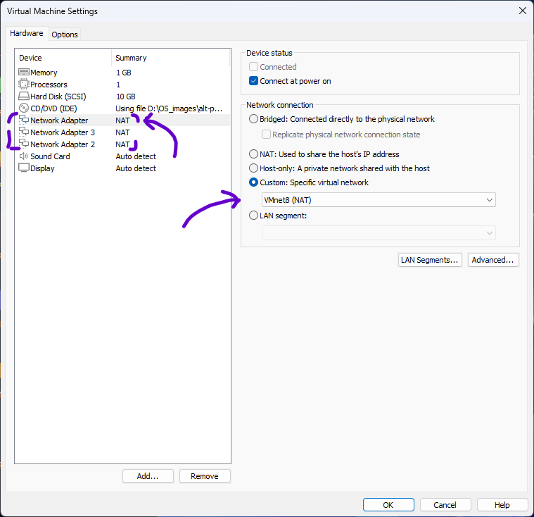

---

2️⃣ Второй адаптер

* VMnet2. Он будет смотреть к HQ-RTR.

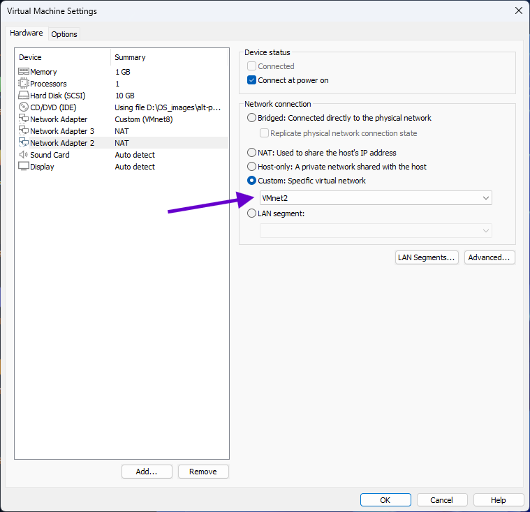

---

3️⃣ Третий адаптер

* VMnet3. Он будет смотреть к BR-RTR.

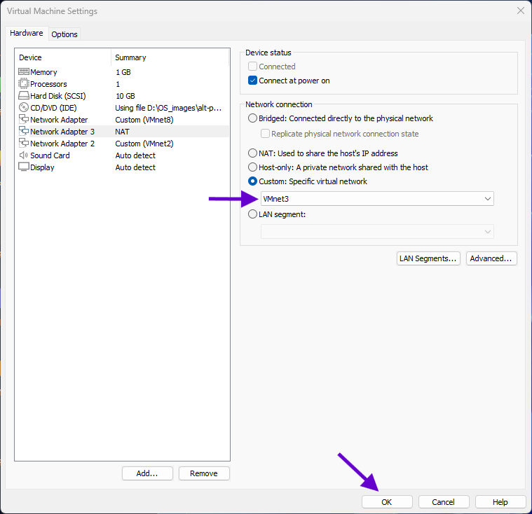

Жмём "OK"

Создание ISP завершено.

---

## Шаг 14 - создание HQ-RTR и BR-RTR.

Особенность их создания в том, что мы используем готовый файл конфигурации формата .ovf (Open Virtualization Format). В нём лежат корректные настройки для создания EcoRouter, чтобы он смог завестись.

Иначе, если пробовать создавать ВМ вручную, она будет в бесконечном зависании на экране "Welcome to GRUB", я пробовал.

Создайте отдельные каталоги для роутеров HQ-RTR-m1 м BR-RTR-m1 и скопируйте в них EcoRouter-0.vmdk

Также вместе с .ovf файлом в той же директории должен лежать EcoRouter-0.vmdk диск

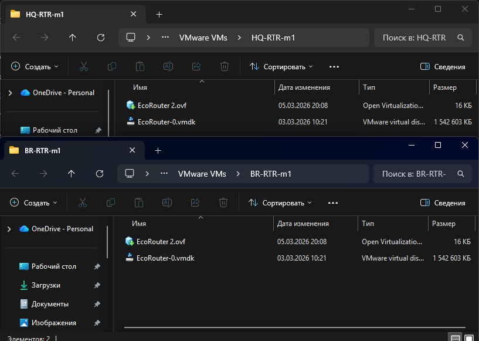

Нажимаем:

"Open a Virtual Machine"

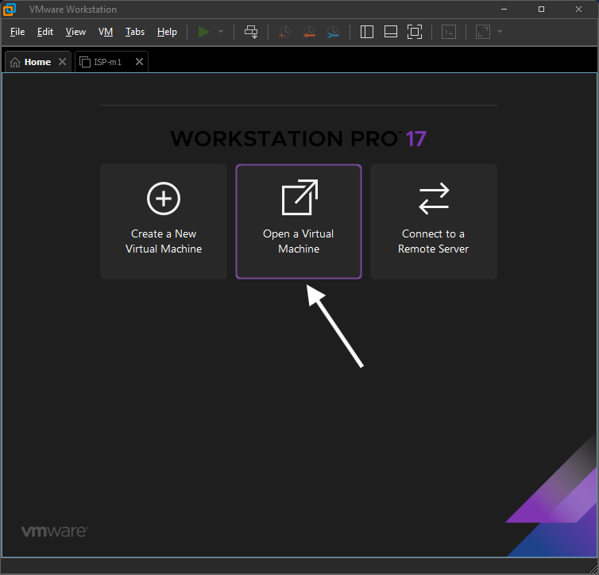

Выбираем подготовленный .ovf файл. Он лежит в mydocs репозитория.

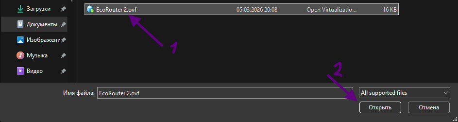

---

### Шаг 15

Откроется окно. Вписываем имя и расположение для нашего HQ-RTR-m1

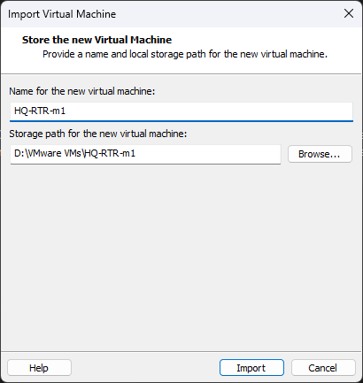

Жмём "Import" и ждём импортирования нашей ВМ

---

### Шаг 16

Получили созданную ВМ

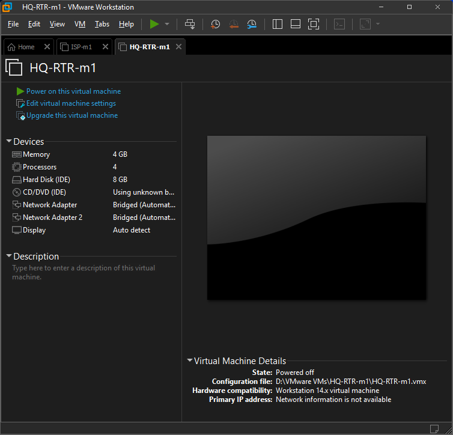

По желанию можете изменить кол-во процессоров и объём RAM. Позже я изменил изначальное число ядер на процессор с 4 на 1, а изначальное число ядер с 1 на 2. Сделал, чтобы процессор не был постоянно нагружен на 100%. 

Важно изменить конфигурацию сетевых адаптеров.

Жмём на "Network Adapter"

---

### Шаг 17

Первый адаптер - "VMnet2". К ISP
Второй адаптер - "VMnet4". К HQ-сети (VLAN)

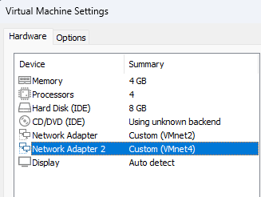

Применяем.

---

### Шаг 18

Создайте BR-RTR-m1 по такому же принципу как и HQ-RTR-m1

Адаптеры настраиваем так:

Первый адаптер - "VMnet3". К ISP
Второй адаптер - "VMnet5". К BR-сети

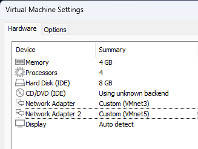

---

### Шаг 19

Создайте оставшиеся ВМ HQ-SRV (Alt Server 10.1), HQ-CLI (Alt Workstation 10.1), BR-SRV (Alt Server 10.1) по аналогии с ISP.

Используйте соответствующие имена, расположения, iso-образы, парметры CPU, RAM, Disk для текущей ВМ.

Конфигурация сетевых адаптеров:

HQ-SRV: "VMnet4"

HQ-CLI: "VMnet4"

BR-SRV: "VMnet5"

Результат - 6 созданных ВМ

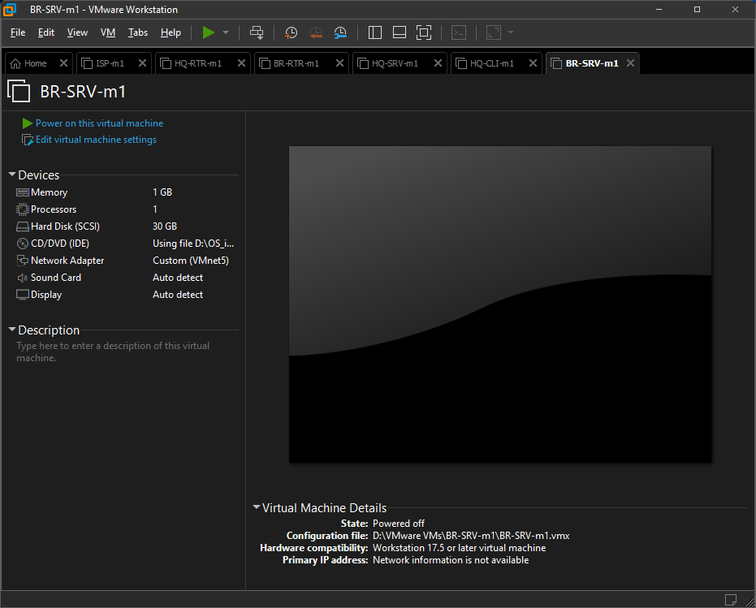

---

### Шаг 20

Проведите пробный запуск всех ВМ. Установите операционные системы. Пароли можно любые поставить, но на демоэкзамене такие пароли (пользователь учетки:пароль): isp - root:toor, hq-rtr и br-rtr - admin:admin, hq-srv - root:toor, hq-cli - HQ-CLI:resu root:toor, br-srv - root:toor.  Убирайте все возможные галочки на моменте "Установка системы", ставьте профиль "Минимальная установка", это будет максимально приближенно к реальным условиям.

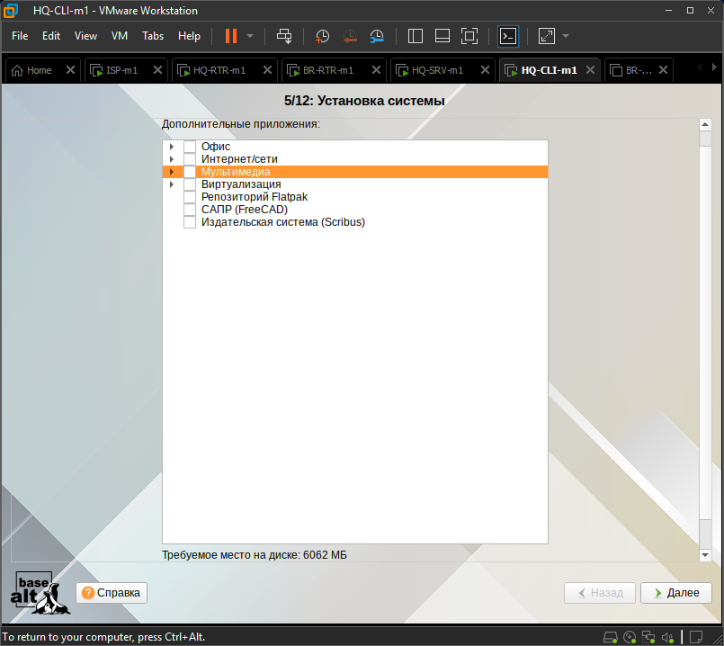

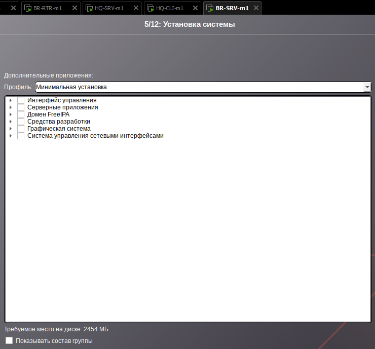

При запуске роутера может показать окно, где нужно выбрать что сделать с диском, выбираем - "Convert"

Итог - установленные и готовые к настрйоке виртуальные машины

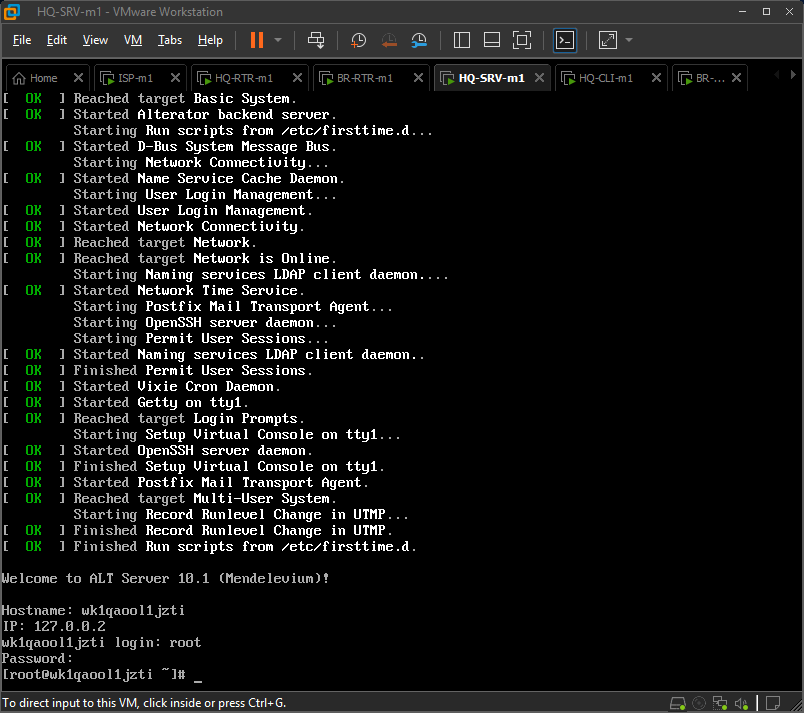

---

### Шаг 21 (НЕОБЯЗАТЕЛЬНО)

Данный шаг является необязательным, но упростит работу с HQ-RTR и BR-RTR как и в среде VMware, так и в Proxmox.

По умолчанию, спустя некоторое время бездействия, EcoRouter разлогинивает вас с учётной записи, что заставляет вас заново вводить логин и пароль

Это поведение можно изменить, прописав данные настройки в линиях консолей console 0 и vty 0 39

```
conf t
line con 0
exec-timeout 0 0
exit
line vty 0 39
exec-timeout 0 0
exit
write memory
```

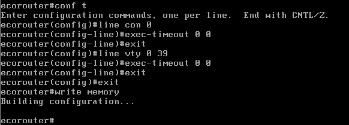

После пишем exit, перезаходим для применения тайм-аутов

write memory - команда для записи изменений в маршрутизатор. 

Для большинства команд используются сокращённые версии (en, conf t, show run, wr mem, ip a и т.д.)

---
